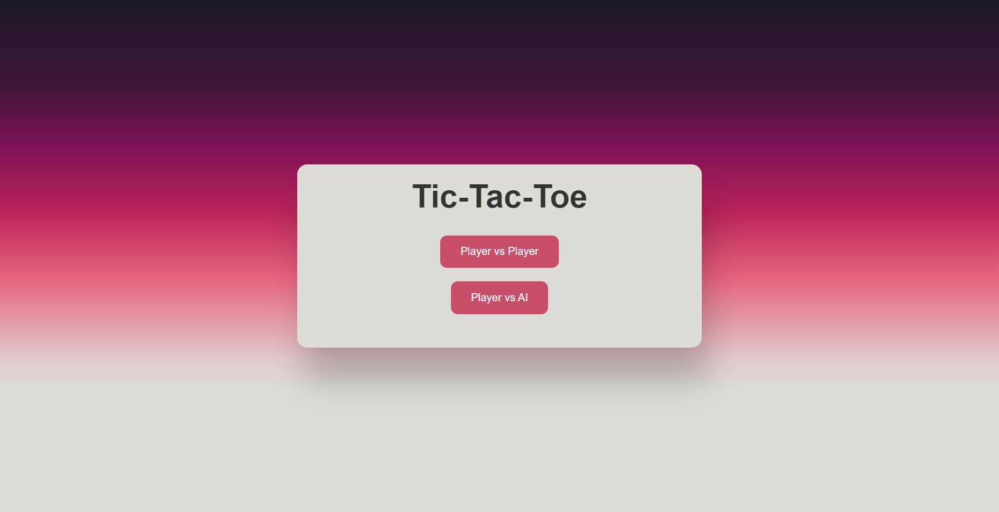
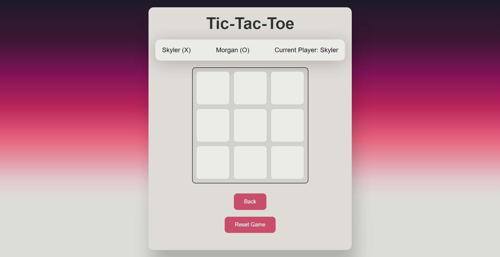
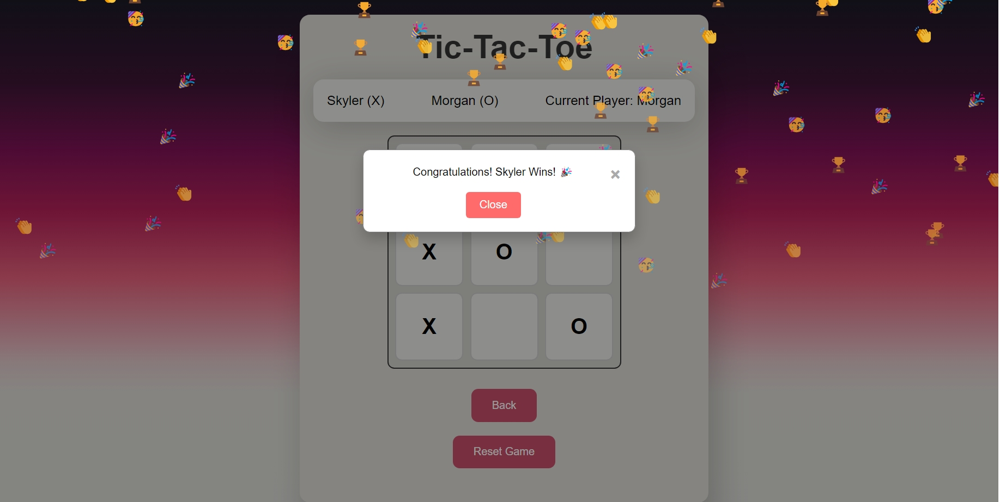
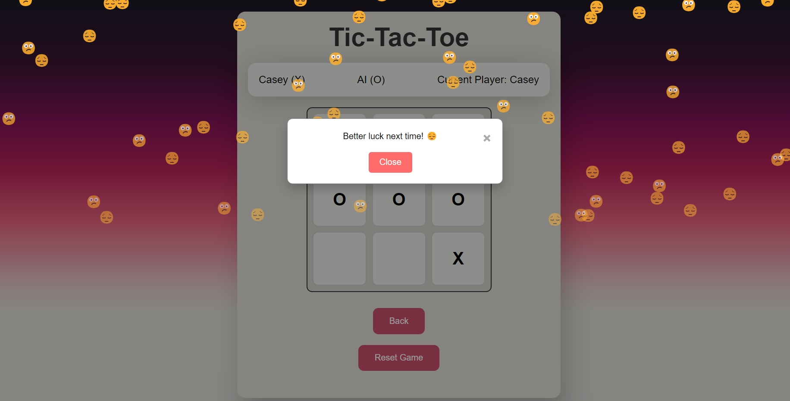

# Tic-Tac-Toe Web Application

This is a modern and feature-rich Tic-Tac-Toe game built using HTML, CSS, and JavaScript. The application allows users to play against another player (PvP) or against a highly challenging AI (PvAI). The game includes a stylish design, animations, and various enhancements to provide an engaging experience.

## Table of Contents

- [Features](#features)
- [Technologies Used](#technologies-used)
- [Getting Started](#getting-started)
  - [Prerequisites](#prerequisites)
  - [Installation](#installation)
  - [Game Instructions](#game-instructions)
- [Customization](#customization)
- [Screenshots](#screenshots)
- [Contributing](#contributing)
- [Notes](#notes)

## Features

- **Player vs Player (PvP)**: Play against another human.
- **Player vs AI (PvAI)**: Challenge a powerful AI opponent.
- **Dynamic Player Names**: Randomly generated player names for each game.
- **Win/Loss/Draw Messages**: Congratulatory or encouragement messages displayed with animations.
- **Emoji Rain Animation**: Celebratory or consolation emoji rain when the game ends.
- **Back to Main Menu**: Easily return to the main menu from the game board.
- **Responsive Design**: Optimized for various screen sizes.
- **Stylish UI**: Modern design with beautiful gradients and smooth transitions.

## Technologies Used

- HTML
- CSS
- JavaScript

## Getting Started

### Prerequisites

Make sure you have a web browser installed (e.g., Chrome, Firefox, Safari).

### Installation

1. Clone the repository:
    ```bash
    git clone https://github.com/Mohana-Sundar-M/Prasunet_WD_03.git
    cd Prasunet_WD_03
    ```

2. Open the `index.html` file in your web browser:
    ```bash
    open index.html
    ```

### Game Instructions

1. **Main Menu**:
    - Select either "Player vs Player" or "Player vs AI" to start the game.

2. **Game Board**:
    - The current player's turn is indicated at the top.
    - Players take turns clicking on the cells to place their markers (X or O).
    - The game announces a winner or a draw when the game ends.

3. **Ending the Game**:
    - A popup message will appear, showing the result (win, draw, or loss).
    - Emoji rain animation will accompany the popup message.
    - Click the "Close" button on the popup to close it.

4. **Returning to Main Menu**:
    - Click the "Back" button to return to the main menu.
## Customization

- **Styling**: Customize the styles in `styles.css`.
- **AI Difficulty**: Adjust the AI logic in `script.js` to change the difficulty level.

## Screenshots

### Main Menu


### Game Board


### Win Popup


### Loss Popup


## Contributing

Feel free to submit issues and pull requests. For major changes, please open an issue first to discuss what you would like to change.

## Notes

- This project was developed as an internship project.

